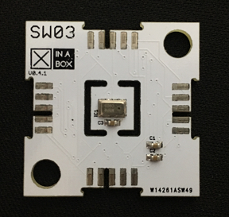

# xSW03

## Requirments
  - [xCore Library](https://github.com/xinabox/xCore)
  - [Arduino IDE 1.8.1](https://www.arduino.cc/en/main/software)
  - ☒CHIP CWO1 or CC01 or CR01
  
## Installation Guide
To install the libraries please follow the guide provided on the [Arduino Website](https://www.arduino.cc/en/Guide/Libraries) under "**Importing a .zip Library**".
